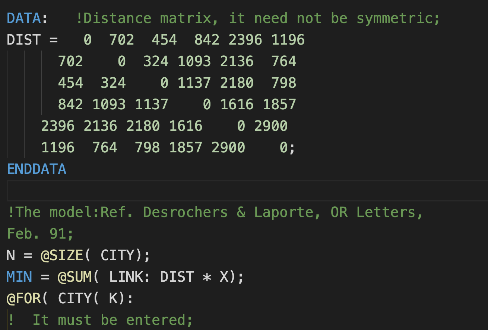
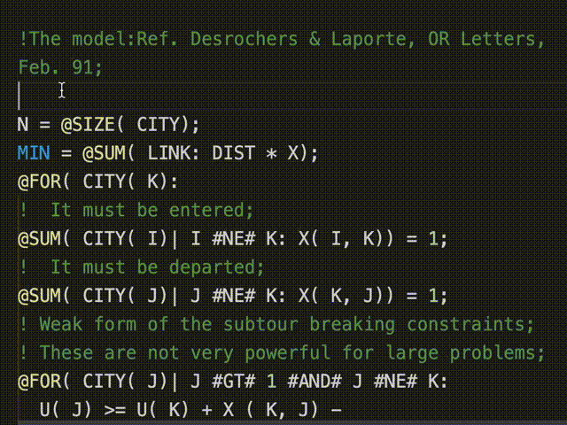

# lingo-language-support README

Language support for Lingo text models in VSCode.

## Features

Syntax higlighting:

Snippets:

## Supported Files

This extension only support Lingo text models (with `.lng` extension). For binary Lingo models (with `.lg4` extension), you should open it in Lingo and save it as `Lingo text model` or copy it directly to text files.

## Release Notes

### 1.0.0

Initial release.

### 1.0.1

Added syntax higlighting and snippets for some elements.
